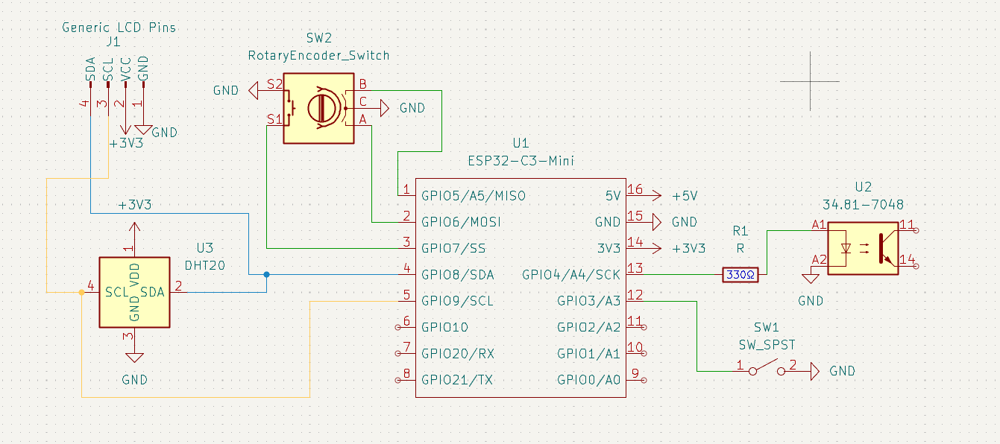

# Heating-Panel-Customisation

This ESP-based device is an upgrade for a heating panel that lacks a thermostat, it will switch off the panel once it reaches the correct temperature. And all that in a formfactor of 5,8 x 2,9 x 3,3 cm (excl. the clip on the bottom).

## Why did I make it?

My parents asked me if I could make something that would automatically turn off a heating panel if it reached a certain temperature. So I started this project to make a device that would do that and integrated with Home Assistant (because why not?).

## How does it work

The device consists of an ESP, a relay, and a temperature sensor. And for user input it also has a switch for turning the device on and off, a rotary encoder for setting the temperature, and an LCD showing the current temperature, set temperature and status. The wiring can be seen below.

The ESP will sense the temperature in the room and turn on a relay that is connected to the heater if it is under the requested temperature. The ESP is powered from a socket that is going to be placed inside of the heating panel. See the schematic below.

The device's clip (see image below) can be placed on the ridge of the heating panel and be secured with bolts. There will have to be a hole drilled in the heating panel, through which the charging cable and cabel for the relay will be placed.

## How to assemble the device

Below is a GIF showing the process of putting the device together. Some steps are left out, like installing the outlet, connecting the ESP to it, connecting the relay inside the heating panel and to the ESP.

## BOM

- ESP32 C3 Mini
- 0.96 inch serial OLED screen
- DHT20 Temperature and Humidity sensor
- EC11 Rotary Encoder
- DC rocker switch
- Solid-State Relay (25 Amp 230 AC)
- 2 x push-in terminal blocks
- Female plug for mains power
