# Heating-Panel-Customisation

This ESP-based device is an upgrade for a heating panel that lacks a thermostat, it will switch off the panel once it reaches the correct temperature. And all that in a formfactor of 5,8 x 2,9 x 3,3 cm (excl. the clip on the bottom).

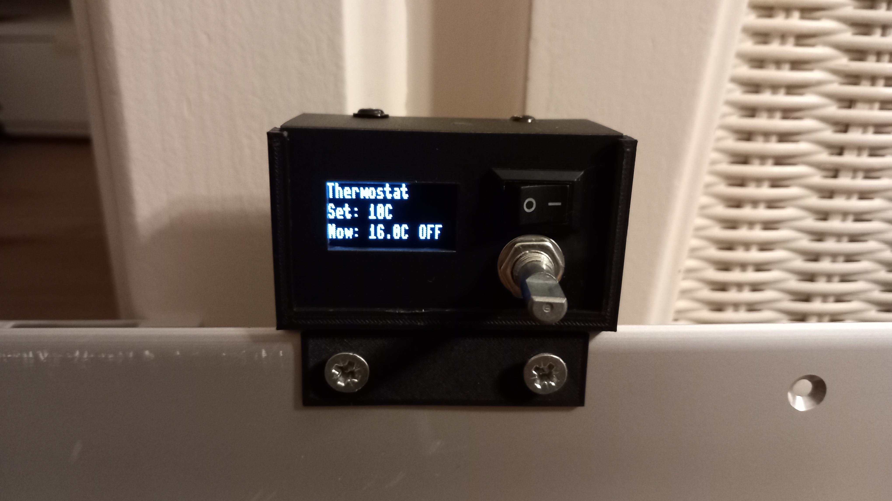

## Why did I make it?

My parents asked me if I could make something that would automatically turn off a heating panel if it reached a certain temperature. So I started this project to make a device that would do that and integrated with Home Assistant (because why not?).

## How does it work

The device consists of an ESP, a relay, and a temperature sensor. And for user input it also has a switch for turning the device on and off, a rotary encoder for setting the temperature, and an LCD showing the current temperature, set temperature and status. The wiring can be seen below.

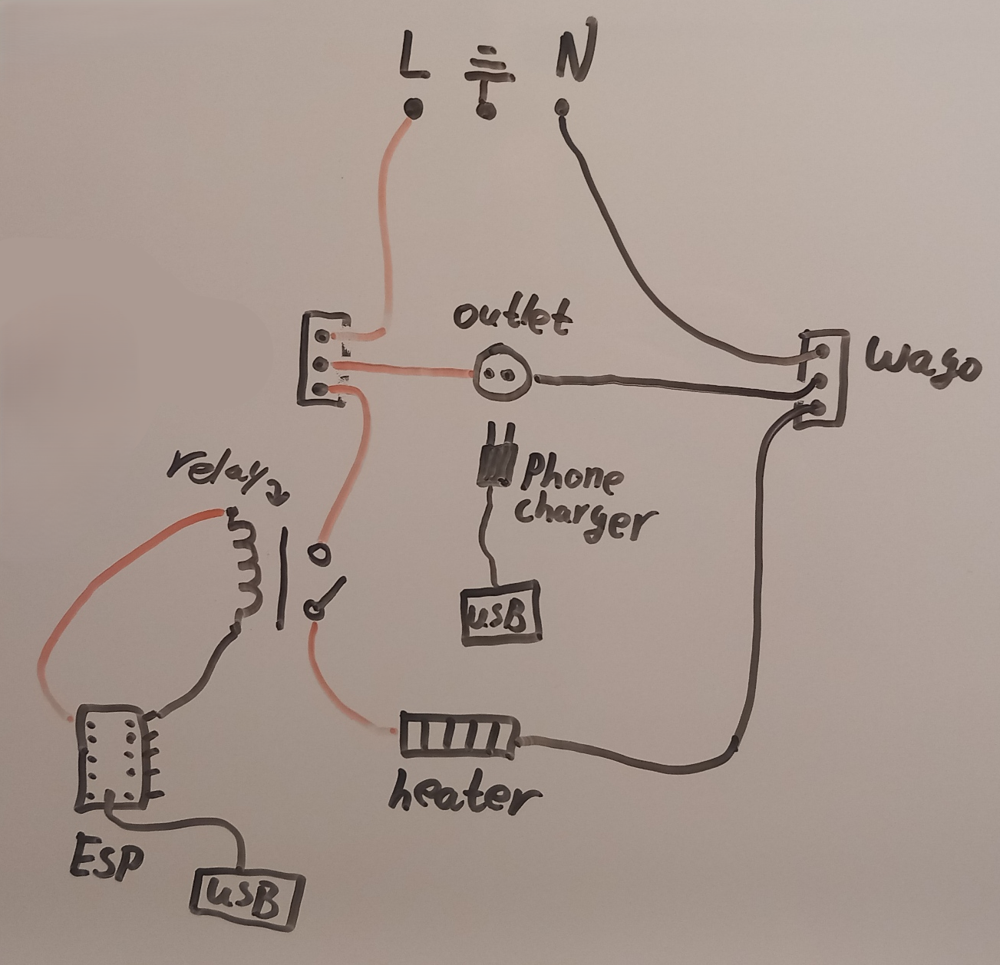

The ESP will sense the temperature in the room and turn on a relay that is connected to the heater if it is under the requested temperature. The ESP is powered from a USB powerbrick inside the heating panel. I made a schematic with pictures of the components, but it isn't that clear.

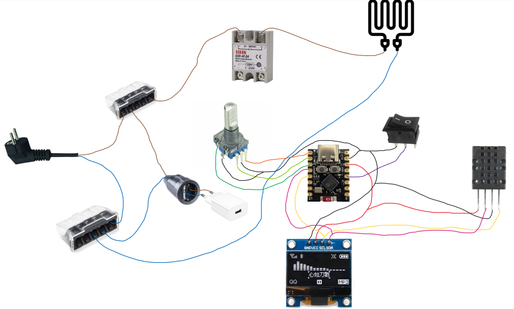

The device's clip (see image below) can be placed on the ridge of the heating panel and be secured with bolts. There will have to be a hole drilled in the heating panel, through which the charging cable and cabel for the relay will be placed.

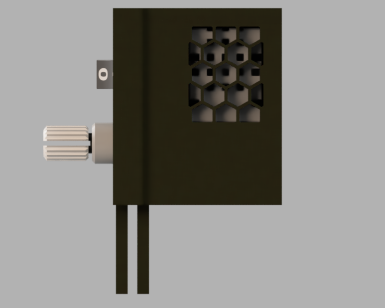
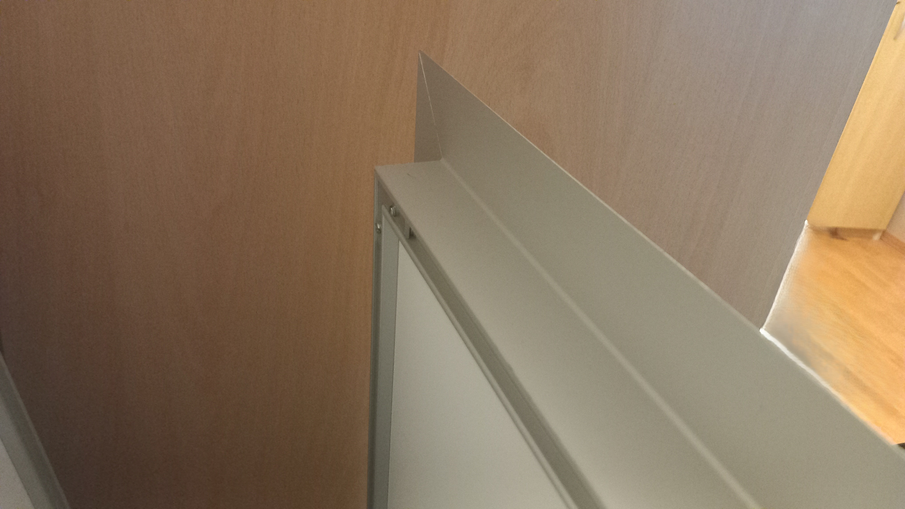

## How to assemble the device

Below is a GIF showing the process of putting the device together. Some steps are left out, like installing the outlet, connecting the ESP to it, connecting the relay inside the heating panel and to the ESP.


## How to install firmware

> The firmware isn't done at the time of writing, but as soon as I am done testing I will update the ```device.py```

To install the firmware use a program like Thonny IDE and upload all of the files ending in ```.py``` inside the Firmware folder and rename ```Device.py``` to main.py

## BOM

> USD prices are at the time of writing, use  a currency converter for more accurate USD prices

| Item | Description | Amount | Already owned | Cost (€) | Cost (US$) | URL | Image |
|------|-------------|--------|---------------|----------|------------|-----|-------|
| ESP32 C3 Mini | ESP module | 1 | no | 2.99 | 3.52 | <https://nl.aliexpress.com/item/1005010612626337.html> | 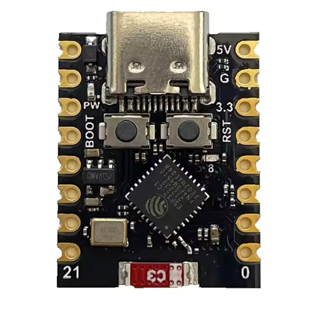 |
| SSD1306 LCD | 4 pin serial LCD | 1 | no | 2.10 | 2.47 | <https://nl.aliexpress.com/item/1005010446208996.html> | 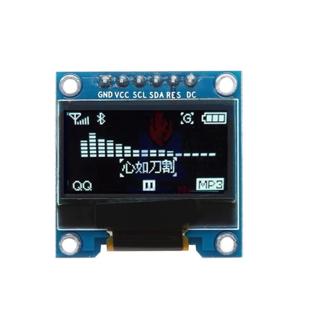 |
| DHT20 Sensor | Temperature and humidity sensor | 1 | no | 1.16 | 1.37 | <https://nl.aliexpress.com/item/1005006337702724.html> | 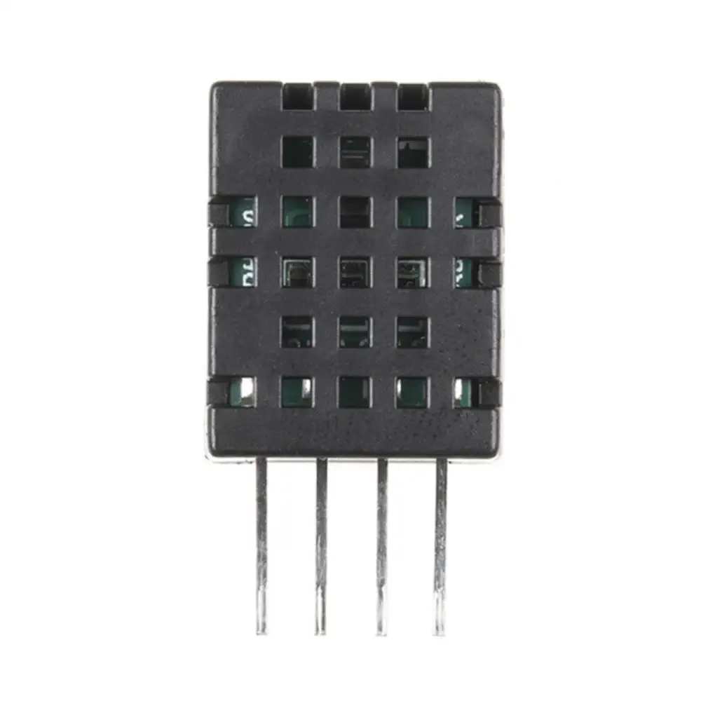 |
| EC11 Encoder | Rotary encoder with push button | 1 | no | 1.27 | 1.50 | <https://nl.aliexpress.com/item/1005008773438800.html> | 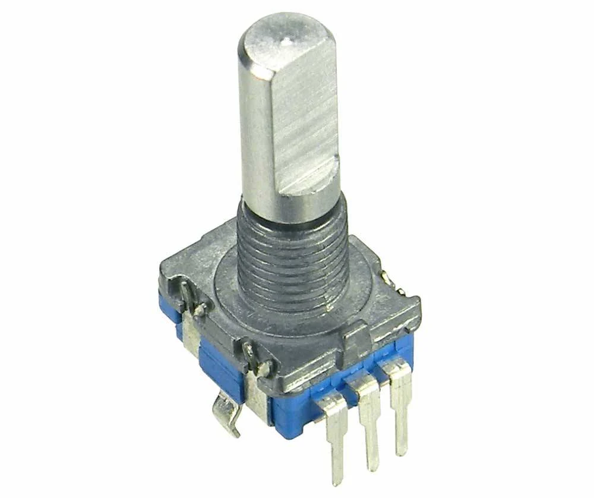 |
| Female plug | Internal plug to power ESP | 1 | no | 1.69 | 1.99 | <https://www.gamma.nl/assortiment/handson-contrastekker-zwart/p/B275982> | 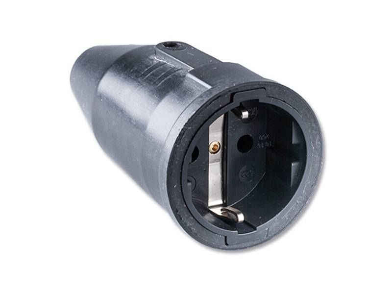 |
| Relay (230 AC 25A) | Solid-state relay (3V trigger) | 1 | no | 3.37 | 3.97 | <https://nl.aliexpress.com/item/1005006782419296.html> | 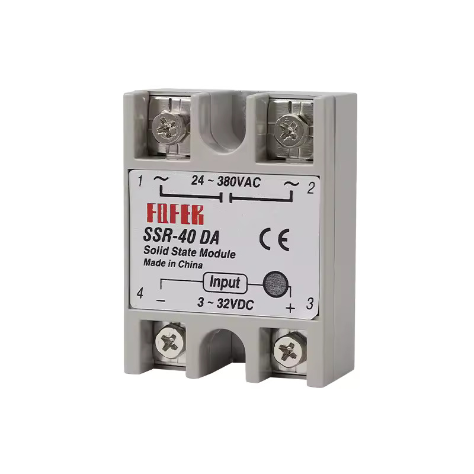 |
| DC Rocker Switch | Simple small DC switch | 1 | yes | - | - | - | 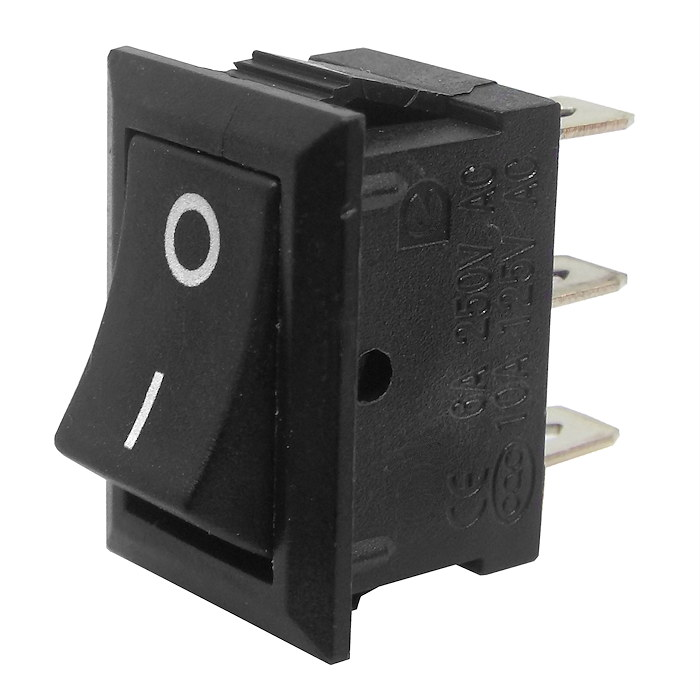 |
| Terminal block | Like a WAGO, but cheap | 2 | yes | - | - | - |  |
| AC and DC wires | ~2.5m AC + DC wiring | - | yes | - | - | - |  |
| Phone charger | ESP power supply | 1 | yes | - | - | - | 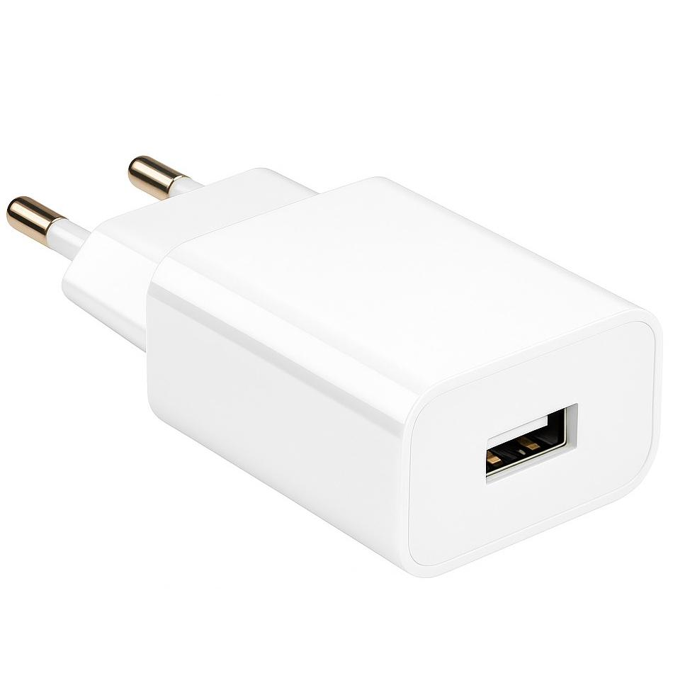 |
